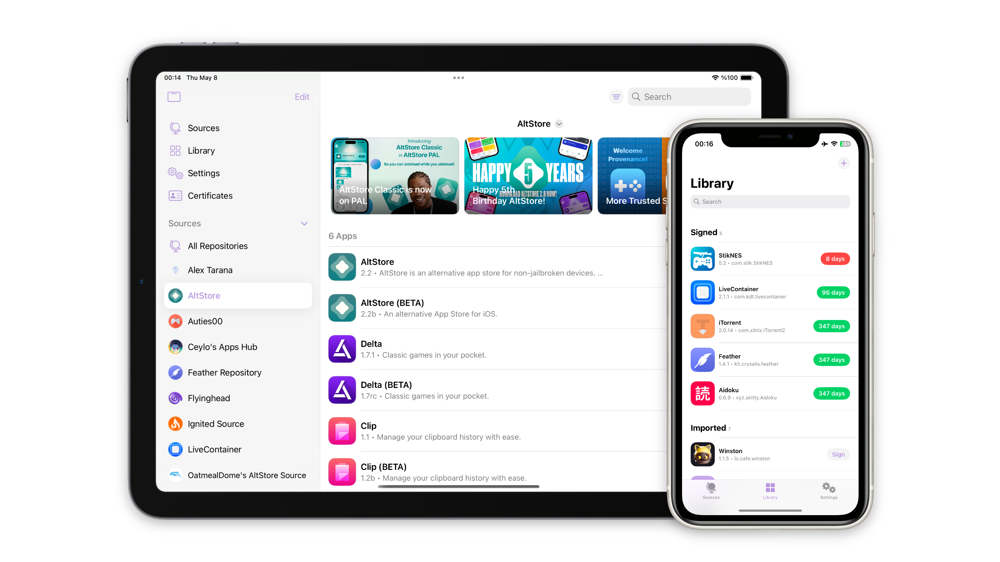

# RyukSign

[](https://github.com/faroukbmiled/RyukSign/releases)
[](https://github.com/faroukbmiled/RyukSign/releases)
[](https://github.com/faroukbmiled/RyukSign/blob/main/LICENSE)

RyukSign is an on-device app signer and installer for iOS, derived from [Feather](https://github.com/claration/Feather). It installs and manages applications using certificate pairs and various installation techniques, entirely on-device using built-in features. RyukSign extends Feather with a Tweak Manager, a built-in File Transfer server, an enhanced download manager, and curated repository support.

> **RyukSign is a fork of [Feather](https://github.com/claration/Feather) by [claration](https://github.com/claration).** All upstream work and attribution is preserved; see [Acknowledgements](#acknowledgements) and [Credits](#credits).

<p align="center"><picture><source media="(prefers-color-scheme: dark)" srcset="Images/Image-dark.png"><source media="(prefers-color-scheme: light)" srcset="Images/Image-light.png"></picture></p>

## Features

Inherited from Feather:

- User-friendly, clean UI.
- Sign and install applications using a `.p12` / `.mobileprovision` pair (via Zsign).
- Supports [AltStore](https://faq.altstore.io/distribute-your-apps/make-a-source#apps) repositories.
- View detailed information about apps and certificates.
- Configurable signing options (appearance, Files-app support, compatibility patching, Liquid Glass).
- No tracking or analytics.
- Open source and free.

Added by RyukSign:

- **Auto Cleanup** — one screen (Settings → Auto Cleanup) that deletes apps, downloaded IPAs, caches, temporary files, leftovers and exported IPAs by itself after every sign and install, so nothing has to be removed by hand. Includes a one-tap "import → sign → install → clean" pipeline.
- **IPA Explorer** — open an IPA (or any app in your library) and browse every file inside it: edit `Info.plist` key by key or as raw XML, edit text files, preview and replace images, add/rename/replace/delete files, then rebuild the IPA or sign and install it directly.
- **Tweak Manager** — import, organize, and inject `.dylib`, `.deb`, `.framework`, `.bundle`, and `.appex` tweaks. Multi-file tweaks, per-file configuration, a file-info/dependency inspector, and ElleKit/CydiaSubstrate detection.
- **Live Activities & Dynamic Island** — watch download progress live from the Lock Screen and Dynamic Island, plus an in-app download overlay.
- **Enhanced download manager** — fast background downloads that keep running while you use other apps.
- **File Transfer server** — upload IPAs and tweaks over HTTP (drag-and-drop browser page) or WebDAV (mount in Finder / the Files app), with optional password protection.
- **App update checker** — flags installed apps that have a newer version available in your sources, with per-app ignore/skip, plus **Update All** to re-sign and queue every update in one tap.
- **Batch signing** — select any number of apps in the Library and sign (and install) them in one queue, with per-app properties, icons and certificates.
- **Logs tab** — a live console of everything the app does (signing, tweak injection, installs, downloads, automation) with level filters, on-disk history, and share/copy/clear.
- **File Manager** — browse all of RyukSign's documents, edit text and `.plist` files, create, import, move, share and delete, with Library and Certificates kept in sync when a managed folder is removed.
- **Backup & Restore** — export certificates, sources, tweaks and settings to an encrypted `.ryukbackup` archive and restore them on another install.
- **Anti-Revoke** — generate a DNS-over-HTTPS configuration profile that pins the resolver used for Apple's certificate-verification hosts, for you to install yourself.
- **Game Mode** — stops downloads and the background update pass while you play, so RyukSign uses no data and next to no battery. (Separately, Signing Options → Game Mode stamps `GCSupportsGameMode` into an app you sign.)
- **Automation** — an opt-in scheduled pass that checks sources for updates, optionally signs and queues them, runs the cleanup sweep and posts one summary notification.
- **Curated repositories** and a fully configurable tab bar.

## Automation

Everything RyukSign can do on its own lives in **Settings → Auto Cleanup**:

| Toggle | What it does |
| --- | --- |
| Auto Cleanup | Master switch for every option below. |
| One-Tap Install | Import or download an app and RyukSign signs it, installs it, drops it from the library and clears the caches. |
| Delete Installed App | Removes the signed app from RyukSign's library once installing finishes. It stays on your device. |
| Delete Downloaded IPA | Deletes the IPA RyukSign downloaded or imported as soon as it became a library app. |
| Delete Unsigned App | Removes the file you imported once it has been signed. |
| Delete Signed App | Removes the signed copy too, unless it is being installed or exported. |
| Clear Caches / Temporary Files / Leftovers / Exported IPAs | Storage sweeps that run after each sign and install. |
| Clean Now | Runs the storage sweeps immediately and shows how much was freed. |

Deletions are staged on disk, so an install that finishes while the app is closed is still cleaned up on the next launch. A short toast reports what was removed and how much space was freed.

## How does it work?

How Feather works is a bit complicated, with multiple ways to install, app management, tweaks, etc. The important pieces:

To start, we need a validly signed IPA, achieved with Zsign using a provided IPA plus a `.p12` and `.mobileprovision` pair.

#### Install (Server)

- Use a locally hosted server for the IPA files used for installation (and assets such as icons).
  - On iOS 18, a few entitlements are needed: `Associated Domains`, `Custom Network Protocol`, `MDM Managed Associated Domains`, `Network Extensions`.
- Include valid HTTPS SSL certificates (we use [*.backloop.dev](https://backloop.dev/)).
- Then `itms-services://?action=download-manifest&url=<PLIST_URL>` initiates the install via `UIApplication.open`.

Due to iOS 18 entitlement changes, an alternative is needed: either install fully locally via the local server (above), or use an external HTTPS server as a middle-man for `PLIST_URL` while keeping the files local — for the latter, a plain insecure local server plus [plistserver](https://github.com/nekohaxx/plistserver) for the `PLIST_URL`, and a Safari webview redirect to the `itms-services://` URL.

#### Install (Pairing)

- Establish a heartbeat with a TCP provider, requiring a [pairing file](https://github.com/jkcoxson/idevice_pair) and a VPN.
- Connect to the socket routed to `10.7.0.1`, establish an `AFC` connection, create `/PublicStaging/`, upload the IPA, and install it directly — similar to `ideviceinstaller`, but fully on-device.

This path needs both a VPN and a lockdownd pairing file (so a computer for initial setup); otherwise use the server install method.

## Download

Visit [RyukSign releases](https://github.com/faroukbmiled/RyukSign/releases) and get the latest `.ipa`.

## Building from source

RyukSign uses Xcode 16 (synchronized groups, `objectVersion 77`) and Swift Package Manager plus git submodules. See [CONTRIBUTING.md](./CONTRIBUTING.md). In short:

```bash
git clone --recursive https://github.com/faroukbmiled/RyukSign.git
cd RyukSign
make deps          # fetches the backloop.dev SSL pack used by the local install server
open RyukSign.xcworkspace
```

Signing identity is not committed in a usable form — set your own team / enable automatic signing in Xcode, or build the unsigned CLI path via `make`.

## Contributing

Read the [contribution requirements](./CONTRIBUTING.md) for more information.

## Acknowledgements

- [claration](https://github.com/claration) — author of [Feather](https://github.com/claration/Feather), the project RyukSign is derived from.
- [idevice](https://github.com/jkcoxson/idevice) — backend used for communication with `installd`.
- [*.backloop.dev](https://backloop.dev/) — localhost with a public-CA-signed SSL certificate.
- [Vapor](https://github.com/vapor/vapor) — server-side Swift HTTP web framework.
- [Zsign](https://github.com/zhlynn/zsign) — on-device signing, reimplemented for iOS.
- [ElleKit](https://github.com/tealbathingsuit/ellekit) — tweak injection.
- [LiveContainer](https://github.com/LiveContainer/LiveContainer) — fixes / help.
- [Nuke](https://github.com/kean/Nuke) — image caching.
- [Asspp](https://github.com/Lakr233/Asspp) — HTTP server setup reference.
- [plistserver](https://github.com/nekohaxx/plistserver) — hosted on https://api.palera.in.

## License

This project is licensed under the **GPL-3.0** license — see [LICENSE](./LICENSE) for the full text. As a derivative of Feather (also GPL-3.0), RyukSign preserves that license. The complete corresponding source for every distributed binary is this repository: <https://github.com/faroukbmiled/RyukSign>.

By contributing, you agree to license your code under GPL-3.0 (including agreeing to license exceptions), ensuring your work remains freely accessible and open.

## Disclaimer

RyukSign is maintained here, on GitHub, and releases are distributed here, on GitHub. Avoid any other sites hosting this software — they are often malicious and exist to mislead users.

## Credits

- [Feather](https://github.com/claration/Feather) — the upstream project RyukSign is based on.
