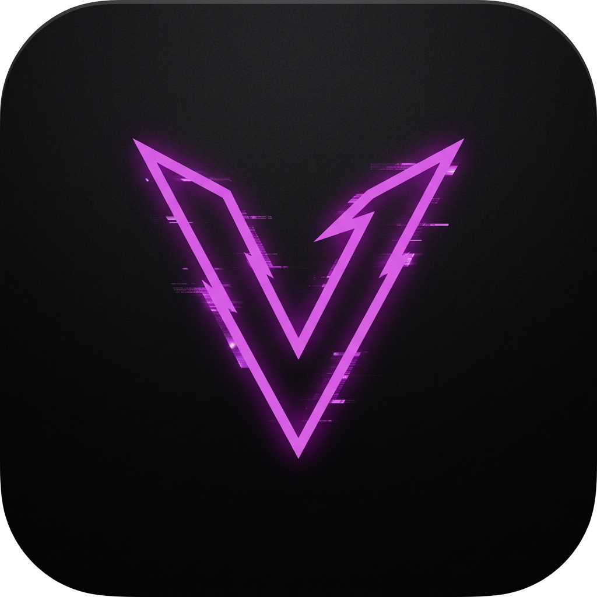

# VexSign

[](https://github.com/iamsmmh/VexSign/releases)
[](https://github.com/iamsmmh/VexSign/releases)
[](LICENSE)
[]()
[]()
[](https://github.com/claration/Feather)

**The most powerful on-device iOS signer. No PC. No revoke fear. Just sign and install.**

Built and maintained by **[@iamsmmh](https://github.com/iamsmmh)** — Crafted for power users who want full control.

> **🙏 Based on [Feather](https://github.com/claration/Feather) by [@claration](https://github.com/claration) (Samara)** — The original open source on-device signer. VexSign is built on top of Feather's solid GPL-3.0 foundation with exclusive features added by @iamsmmh. Without Feather, VexSign wouldn't exist — special thanks to @claration for open sourcing!

<p align="center">
  
</p>

<p align="center">
  
</p>

---

### 👨‍💻 Author & Base

**VexSign** is designed, developed and maintained by **[@iamsmmh](https://github.com/iamsmmh)**

- GitHub: [@iamsmmh](https://github.com/iamsmmh)
- Repository: [iamsmmh/VexSign](https://github.com/iamsmmh/VexSign)

**Base Project:**
- **[Feather](https://github.com/claration/Feather) by [@claration](https://github.com/claration) (Samara)** — Original on-device signer, GPL-3.0. All base signing engine, CoreData model and UI architecture from Feather.

If you like VexSign, please ⭐ star the repo! And please also ⭐ [Feather](https://github.com/claration/Feather) to support the base.

---

### 🚀 Why VexSign? Why not Feather, ESign, KSign, Scarlet?

Most signers do one thing: sign an IPA. **VexSign does everything after that too.**

| Feature | Feather (Base) | ESign / KSign | Scarlet | **VexSign by @iamsmmh** |
| :--- | :---: | :---: | :---: | :---: |
| On-device signing | ✅ | ✅ | ✅ | ✅ (from Feather) |
| Tweak injection | ✅ | ❌ | ✅ | ✅ **Advanced by @iamsmmh** |
| IPA Explorer (edit inside IPA) | ❌ | ❌ | ❌ | ✅ **Exclusive by @iamsmmh** |
| File Transfer (HTTP/WebDAV) | ❌ | ❌ | ❌ | ✅ **Exclusive by @iamsmmh** |
| Live Activities & Dynamic Island | ❌ | ❌ | ❌ | ✅ **Exclusive by @iamsmmh** |
| Auto Cleanup Pipeline | ❌ | ❌ | ❌ | ✅ **Exclusive by @iamsmmh** |
| Batch Signing | ❌ | ❌ | ❌ | ✅ **Exclusive by @iamsmmh** |
| Update All (one-tap) | ❌ | ❌ | ❌ | ✅ **Exclusive by @iamsmmh** |
| Backup & Restore (.vexbackup) | ❌ | ❌ | ❌ | ✅ **Exclusive by @iamsmmh** |
| Logs & File Manager | ❌ | ❌ | ❌ | ✅ **Exclusive by @iamsmmh** |
| No Ads, No Tracking | ✅ | ❌ | ❌ | ✅ (from Feather) |

**VexSign = Feather's solid base + 14 exclusive features by @iamsmmh = The only signer that feels like real App Store.**

---

### ✨ Features

#### 🔹 Base Features — Powered by Feather by @claration

VexSign is built on top of **Feather** by **@claration** — the original open source on-device signer that pioneered the concept. All base features come from Feather's solid foundation:

- Clean native SwiftUI UI with Liquid Glass support (iOS 19+)
- Sign & Install with `.p12` / `.mobileprovision` via Zsign
- AltStore repository support
- Certificate manager with health check (valid / expiring / revoked)
- Custom signing options (display name, bundle ID, Files app, compatibility patches)
- No tracking, no analytics, 100% open source (GPL-3.0)
- View detailed app & certificate info
- Configurable tab bar

> **Credit:** Base signing engine, UI architecture and CoreData model originally from **[Feather](https://github.com/claration/Feather) by [claration](https://github.com/claration)** — Thank you for open sourcing this! Feather is GPL-3.0 licensed, and VexSign preserves that license.

#### 🔥 Exclusive Features — Added by [@iamsmmh](https://github.com/iamsmmh) (Why VexSign > Feather)

These features **do not exist** in Feather or any other signer. Built from scratch for VexSign by @iamsmmh:

**1. 🧹 Auto Cleanup — The App Store Experience**
> One screen in Settings → Auto Cleanup. VexSign automatically deletes downloaded IPAs, signed copies, caches, temp files and leftovers after every install. Includes **One-Tap Install**: import → sign → install → clean, zero manual work.

**2. 📂 IPA Explorer — Edit IPAs Like a Pro**
> Open any IPA and browse every file inside. Edit `Info.plist` key-by-key or raw XML, edit text files, preview and replace images, add/rename/replace/delete files, then rebuild IPA or sign & install directly. No other signer has this.

**3. 🔧 Tweak Manager — Advanced Injection**
> Import, organize and inject `.dylib`, `.deb`, `.framework`, `.bundle`, `.appex`. Multi-file tweaks, per-file config, dependency inspector, ElleKit / CydiaSubstrate detection. More powerful than Feather's original.

**4. 📡 File Transfer Server — No Cable Needed**
> Upload IPAs and tweaks over HTTP (drag-and-drop browser page) or WebDAV (mount in Finder / Files app). Optional password protection. Transfer from PC without cable.

**5. ⬇️ Smart Download Manager**
> Fast background downloads that keep running when you switch apps. With **Live Activities & Dynamic Island** — watch progress live from Lock Screen.

**6. 🔄 App Update Checker + Update All**
> Flags installed apps that have newer versions in your sources. Per-app ignore/skip. **Update All** button re-signs and queues every update in one tap — like real App Store.

**7. 📦 Batch Signing**
> Select any number of apps in Library and sign (and install) them in one queue, with per-app properties, icons and certificates.

**8. 📝 Logs Tab — See Everything**
> Live console of everything VexSign does (signing, injection, installs, downloads). Level filters, on-disk history, share/copy/clear.

**9. 🗂️ File Manager**
> Browse all VexSign documents, edit text and `.plist` files, create, import, move, share and delete. Library and Certificates stay in sync.

**10. 💾 Backup & Restore**
> Export certificates, sources, tweaks and settings to encrypted `.vexbackup` archive and restore on another device. One file to rule them all.

**11. 🛡️ Anti-Revoke**
> Generate DNS-over-HTTPS configuration profile that pins resolver for Apple verification hosts.

**12. 🎮 Game Mode**
> Stops downloads and background updates while you play — zero data, zero battery drain. Also stamps `GCSupportsGameMode` into signed apps.

**13. 🤖 Automation**
> Opt-in scheduled pass that checks sources for updates, optionally signs and queues them, runs cleanup sweep and posts one summary notification.

**14. 🎨 And More QoL by @iamsmmh**
> Named signing profiles, install queue summary (retry/skip/stop), source pinning, Wi-Fi only downloads, parallel cap, speed/ETA, Library sort (name/date/size), storage rules, setup wizard, fully configurable tab bar, curated repositories.

---

### 📲 Download

Get the latest `.ipa` from **[Releases](https://github.com/iamsmmh/VexSign/releases)**

Or add this repo to your current signer:
```
https://raw.githubusercontent.com/iamsmmh/VexSign/main/app-repo.json
```

---

### 🛠️ How It Works

**Server Install (Recommended, No PC):**
- Fully local HTTPS server with backloop.dev SSL
- Uses `itms-services://?action=download-manifest&url=<PLIST_URL>` 
- Works on iOS 18+ with new entitlements

**Pairing Install (Direct):**
- AFC install via VPN + pairing file (like ideviceinstaller but on-device)
- Uploads IPA to `/PublicStaging/` and installs directly

---

### 🔨 Building from Source

**Requirements:** Xcode 16+, iOS 15+ SDK, Swift 6.0

```bash
git clone --recursive https://github.com/iamsmmh/VexSign.git
cd VexSign
make deps          # fetches SSL certs for local server
open VexSign.xcworkspace
```

Set your own team in Signing & Capabilities, or build unsigned via `make`.

---

### 🙏 Credits & Acknowledgements

VexSign is made possible by amazing open source developers. **Full proper credits below — thank you to everyone!**

#### 🌟 Base Project — Feather

| Developer | GitHub | Contribution | License |
|-----------|--------|--------------|---------|
| **Samara / @claration** | [@claration](https://github.com/claration) | **[Feather](https://github.com/claration/Feather) — Original on-device signer, base for VexSign. Pioneered on-device signing on stock iOS. Without Feather, VexSign wouldn't exist.** | GPL-3.0 |

> **Special Thanks to Feather:** VexSign is built on top of Feather by @claration. Feather pioneered on-device signing on stock iOS without jailbreak and open sourced it under GPL-3.0. We are deeply grateful. **Please star [Feather](https://github.com/claration/Feather) too!**

**What VexSign uses from Feather:**
- Base signing engine and Zsign integration
- CoreData model and Storage layer (with migration `Feather.sqlite → VexSign.sqlite`)
- SwiftUI UI architecture and Navigation
- AltSourceKit and NimbleKit libraries
- Certificate and Library management

#### 👨‍💻 Lead Developer — VexSign Exclusive Features

| Developer | GitHub | Contribution |
|-----------|--------|--------------|
| **@iamsmmh** | [@iamsmmh](https://github.com/iamsmmh) | **Lead Developer — All exclusive features:** IPA Explorer, File Transfer Server (HTTP/WebDAV), Live Activities & Dynamic Island, Auto Cleanup Pipeline, Batch Signing, Update All, Backup & Restore (.vexbackup), Logs & File Manager, Anti-Revoke, Game Mode, Automation, Named Profiles, and more QoL. |

#### 🔧 Core Dependencies — The Engine

| Developer | Project | GitHub | What it does | License |
|-----------|---------|--------|--------------|---------|
| **jkcoxson** | **idevice** | [@jkcoxson](https://github.com/jkcoxson) | AFC backend for direct install via `installd` — communicates with iOS without PC. Used in Pairing Install. | MIT |
| **Vapor Team** | **Vapor** | [vapor/vapor](https://github.com/vapor/vapor) | Server-side Swift HTTP framework — powers VexSign's local HTTPS install server. | MIT |
| **zhlynn** | **Zsign** | [@zhlynn](https://github.com/zhlynn) | On-device IPA signing — reimplemented for iOS. Signs IPAs with p12/mobileprovision. | MIT |
| **tealbathingsuit** | **ElleKit** | [@tealbathingsuit](https://github.com/tealbathingsuit) | Tweak injection — injects dylibs into IPAs. Supports ElleKit & CydiaSubstrate. | BSD-3 |
| **LiveContainer Team** | **LiveContainer** | [LiveContainer/LiveContainer](https://github.com/LiveContainer/LiveContainer) | Fixes and compatibility help for sideloaded apps. | GPL-3.0 |

#### 📚 Libraries & UI

| Developer | Project | GitHub | What it does | License |
|-----------|---------|--------|--------------|---------|
| **kean** | **Nuke** | [@kean](https://github.com/kean) | Image caching — fast async image loading for app icons and screenshots. | MIT |
| **Weichsel** | **ZIPFoundation** | [weichsel/ZIPFoundation](https://github.com/weichsel/ZIPFoundation) | ZIP handling — extracting and creating IPAs (which are ZIPs). | MIT |
| **Tsolomko** | **SWCompression** | [tsolomko/SWCompression](https://github.com/tsolomko/SWCompression) | Additional archive formats — TAR, etc. for tweak extraction. | MIT |
| **@claration** | **AltSourceKit** | [claration/AltSourceKit](https://github.com/claration/AltSourceKit) | AltStore source parsing — decrypts and parses AltStore repositories. | MIT |
| **@claration** | **NimbleKit** | [claration/NimbleKit](https://github.com/claration/NimbleKit) | UI components — NBList, NBButton, extensions used throughout VexSign. | MIT |

#### 🌐 Services & References

| Developer / Service | GitHub / URL | Contribution |
|---------------------|--------------|--------------|
| **backloop.dev** | [backloop.dev](https://backloop.dev/) | **Public-CA-signed SSL for localhost** — `*.backloop.dev` gives VexSign local server a trusted cert without manual install. Critical for `itms-services` install. |
| **Lakr233** | [@Lakr233](https://github.com/Lakr233) | **Asspp** — HTTP server setup reference, inspired VexSign's local server implementation. |
| **nekohaxx** | [@nekohaxx](https://github.com/nekohaxx) | **plistserver** — Hosted on `api.palera.in`, reference for manifest hosting. |
| **Apple** | — | iOS, SwiftUI, Xcode — the platform. |

#### 💝 Additional Thanks

- **All contributors and translators** — Thank you for PRs, issues, translations!
- **Feather contributors** — Everyone who contributed to Feather base.
- **Testers** — Everyone who tested VexSign betas and reported bugs.
- **You** — For using VexSign and starring the repo!

---

### 📄 License

**GPL-3.0** — See [LICENSE](./LICENSE)

VexSign is licensed under GPL-3.0, same as Feather. As a derivative of Feather (GPL-3.0), we preserve that license and give full credit to upstream.

**Copyright:**
- VexSign exclusive features: (c) 2026 [@iamsmmh](https://github.com/iamsmmh) & VexSign Team
- Base: (c) 2024 Samara / @claration (Feather) — [github.com/claration/Feather](https://github.com/claration/Feather)
- Dependencies: Respective owners (MIT, BSD-3-Clause, GPL-3.0) — see `license_plist.yml` and `LICENSE`

By contributing, you agree to license your code under GPL-3.0, ensuring it remains free and open.

---

### ⚠️ Disclaimer

VexSign is maintained by [@iamsmmh](https://github.com/iamsmmh) on GitHub. Releases only on GitHub. Avoid other sites — they may be malicious.

Use at your own risk. Sideloading may violate Apple Developer Program terms. Not affiliated with Apple Inc. Feather is by @claration, VexSign is by @iamsmmh.

---

<p align="center">
  <b>Made with ❤️ by <a href="https://github.com/iamsmmh">@iamsmmh</a> — VexSign</b><br>
  Based on <a href="https://github.com/claration/Feather">Feather by @claration</a> — Please star both!<br>
  Built with help from amazing open source devs — see Credits above<br>
  If VexSign saves your time, please ⭐ star the repo!
</p>
